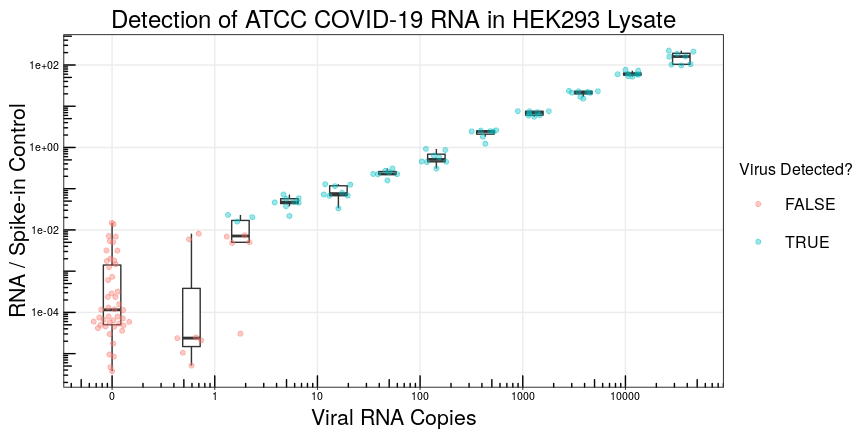

# SwabSeq

SwabSeq allows for detection of SARS-COV-2 genomic RNA, without purification, in a single-step RT-PCR followed by sequencing. This eliminates some of the current bottlenecks to most current COVID sequencing protocols (e.g. rare/expensive reagents, extra purification steps, qPCR), and also utilizes multiplexing to sequence larger batches of samples without extensive automation.

SwabSeq is:

- simple (1 person can run 1-10k samples in a day if in microtiter plates w/ no automation)
- cheap (~$1/sample in consumable costs)
- scalable (~10K samples/day, w/ automation 100k/day or more dependent on thermocycler capacity)
- sensitive (LoD ~1-6 molecules/test) and quantitative (> 3-4 logs)

This method does take time (~12 hours) and requires specialized equipment such as PCR machines and a sequencer, and thus is best suited for centralized testing facilities where scale can be achieved. In addition, there are still technical questions left to be answered, but we feel the results are promising enough for some of our collaborators to start testing on clinical samples. Finally, new technical methodologies such as this will not solve any of the considerable logistical problems of swabbing, data entry, sample processing into microtiter plates, and returning results to that many people at once.

## Getting Started

- [Installation](https://github.com/octantbio/swab-seq/wiki/Installation)
- [Running the Analysis Pipeline](https://github.com/octantbio/swab-seq/wiki/Analysis-Details)
- [Plate Map Spec](https://github.com/octantbio/swab-seq/wiki/Plate-Map-Spec)

## Experimental Protocols

All relevant experimental protocols and details can be found at our Notion

- [Octant COVID-19 Notion](https://www.notion.so/Octant-COVID-Scaling-9eb80e793d7e46348038aa80a5a901fd)

## Contributing

Please feel free to open an issue or pull request.

## Authors

This was done largely by two Octant team members, Eric Jones and Aaron Cooper working out of the Octant lab while things were shut down.

- **Eric Jones** - *Project Lead*
- **Aaron Cooper**
- **Joshua Bloom**
- **Nathan Lubock**
- **Scott Simpkins**
- **Molly Gasperini**
- **Sri Kosuri**

## License

The code contained in this repository is licensed under the Apache 2.0 License - see the [LICENSE](LICENSE) file for details. Additional licensing information:

- [starcode](docker/starcode-license) - GPL-3.0

The associated lab protocols etc. found on our [Notion Page](https://www.notion.so/Octant-COVID-Scaling-9eb80e793d7e46348038aa80a5a901fd) are provided under the [Open Covid Pledge License](https://www.notion.so/Octant-COVID-License-816b04b442674433a2a58bff2d8288df).

## Acknowledgments

The rest of the Octant team has been instrumental in developing this platform over the last several years. In addition, we received a lot of advice on controls to run and how to think about tests from collaborators at UCLA (Jonathan Flint, Leonid Krugylak, Eleazar Eskin, Yi Yin, and Valerie Arboleda), UW (Lea Starita, Jay Shendure, Jase Gehring, Sanjay Srivatsan, Beth Martin), the Broad (Feng Zhang), and UC Berkeley (Fyodor Urnov, Patrick Hsu). We'd also like to thank members of the Covid Scaleup Slack group for helpful discussions.
