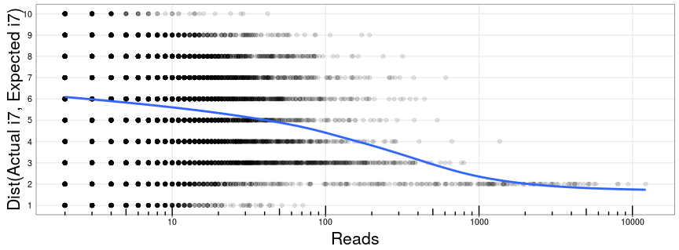
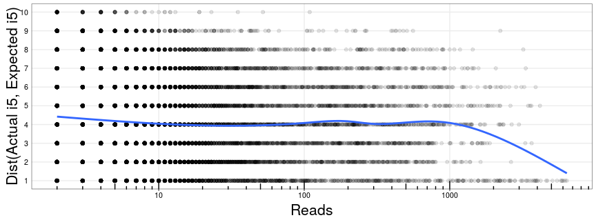
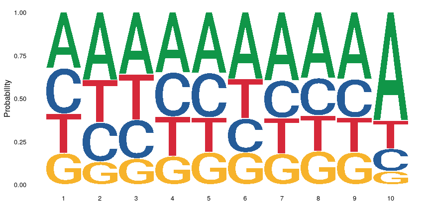
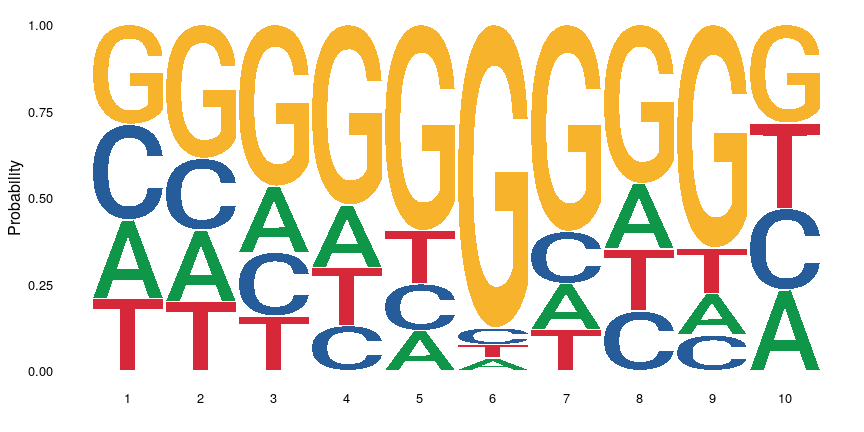

Run06 - Demux Issues
================
Nate
04/28/2020

  - [Quick Index Check](#quick-index-check)
  - [Kallisto Data](#kallisto-data)
  - [Missing Indices](#missing-indices)
  - [Index Distance Calc](#index-distance-calc)
  - [Discrepancies](#discrepancies)

Here we have the i7/i5 index pairs that Kallisto determined to align to
our expected sequences (S2/S2\_Spike/Rpp30). This consisted of \~30% of
the total reads (in line with having \~70% PhiX).

## Quick Index Check

Let’s first check to make sure our actual indices in the SampleSheet are
the ones we ordered. Recall, we have to reverse compliment the i7 index
to match the output of the sequencer. Also, the i7 index will be
associaded with the `f_idx` or `r_idx` depending on the library (a minor
hitch from the original design)

``` r
revcomp <- function(string){
  chartr('ATGC', 'TACG', string) %>% 
    stringi::stri_reverse() %>%
    return()
}

primer.sets <- read_tsv('../../pipeline/200426_M05737_0145_000000000-J46H8/primer-order.tsv')
```

    ## Parsed with column specification:
    ## cols(
    ##   set = col_character(),
    ##   pair_num = col_double(),
    ##   f_idx = col_character(),
    ##   r_idx = col_character()
    ## )

``` r
# check that our sample sheet has the ordered sets
primer.sets %>%
  filter(set == 'RPP30') %>%
  mutate(
    index = revcomp(f_idx),
    index2 = r_idx
  ) %>%
  inner_join(samp.sheet) %>%
  nrow()
```

    ## Joining, by = c("index", "index2")

    ## [1] 384

``` r
primer.sets %>%
  filter(set == 'S2') %>%
  mutate(
    index = revcomp(r_idx),
    index2 = f_idx
  ) %>%
  inner_join(samp.sheet) %>%
  nrow()
```

    ## Joining, by = c("index", "index2")

    ## [1] 384

Yes - both have 384 rows and sample\_id ends in one number.

## Kallisto Data

The `kallisto|bustools` pipeline operates a little differently than what
we are used to. In broad strokes, it:

1.  aligns all of the reads to a reference (in this case our expected
    amplicons)
2.  treats i7/i5 as a “barcode” and demultiplexes based on that

The result of the alignment (Step 1) is as follows:

``` r
head(kallisto)
```

    ## # A tibble: 6 x 6
    ##   i7i5                 foo     ref counts i7         i5        
    ##   <chr>                <chr> <dbl>  <dbl> <chr>      <chr>     
    ## 1 ACACAACACAGACACGGTAT A         4  12222 ACACAACACA GACACGGTAT
    ## 2 AGTGGTACATCTAATGGTTC A         0  11222 AGTGGTACAT CTAATGGTTC
    ## 3 CGTCGGACAACTATCGAATC A         4   9366 CGTCGGACAA CTATCGAATC
    ## 4 GGTGCGATTCTACGCGTCGT A         0   8752 GGTGCGATTC TACGCGTCGT
    ## 5 CACTTCTCTAGATCTGAGGA A         4   8098 CACTTCTCTA GATCTGAGGA
    ## 6 TGCCATTGCATCACAGGACT A         4   7991 TGCCATTGCA TCACAGGACT

a dataframe with `i7i5` “barcode”, a dummy column, what that index
aligns to (`ref`), the associated counts, and the i5/i7 indices. We can
filter these counts down to our expected indices with `bustools` as
well, accounting for 1 error in the i7 and i5 individually with.

``` r
kb <- read_tsv(
  '../../pipeline/200426_M05737_0145_000000000-J46H8/kb.tsv',
  col_names = c('i7i5', 'foo', 'ref', 'counts')
)

kb %$%
  sum(counts)
```

    ## [1] 610785

We can see that only 600k / 6mm correspond to our expected i7/i5 pairs…

## Missing Indices

So what are our most common indices? Let’s try joining on our i7/i5
indices individually. A barcode hopping event will result in an i7/i5
combo with different “pair” numbers. (Recall, our primers are designed
with i7/i5 index pairs).

First let’s get our primer sets oriented properly

``` r
# what pairs are we seeing most often?
# S2    - i5:F, i7:R
# RPP30 - i7:F, i5:R
# we must rev-comp S2_R and RPP30_F
foo <- primer.sets %>%
  filter(set == 'RPP30') %>%
  mutate(
    index = revcomp(f_idx),
    index2 = r_idx
  ) 

bar <- primer.sets %>%
  filter(set == 'S2') %>%
  mutate(
    index = revcomp(r_idx),
    index2 = f_idx
  ) 

primer.orient <- bind_rows(foo, bar)

i7 <- bind_rows(foo, bar) %>%
  select(i7_set = set, i7_pair = pair_num, i7 = index)

i5 <- bind_rows(foo, bar) %>%
  select(i5_set = set, i5_pair = pair_num, i5 = index2)
```

Now we can join them onto the raw kallisto output

``` r
i7i5.join <- kallisto %>%
  left_join(i7) %>%
  left_join(i5) 

i7i5.join %>%
  head(10)
```

    ## # A tibble: 10 x 10
    ##    i7i5         foo     ref counts i7      i5      i7_set i7_pair i5_set i5_pair
    ##    <chr>        <chr> <dbl>  <dbl> <chr>   <chr>   <chr>    <dbl> <chr>    <dbl>
    ##  1 ACACAACACAG… A         4  12222 ACACAA… GACACG… <NA>        NA RPP30      787
    ##  2 AGTGGTACATC… A         0  11222 AGTGGT… CTAATG… S2        1373 S2        1373
    ##  3 CGTCGGACAAC… A         4   9366 CGTCGG… CTATCG… <NA>        NA RPP30        4
    ##  4 GGTGCGATTCT… A         0   8752 GGTGCG… TACGCG… S2        1082 S2        1082
    ##  5 CACTTCTCTAG… A         4   8098 CACTTC… GATCTG… <NA>        NA RPP30      655
    ##  6 TGCCATTGCAT… A         4   7991 TGCCAT… TCACAG… <NA>        NA RPP30     1190
    ##  7 AACAGCGTTAA… A         0   6721 AACAGC… AGTTCG… S2         907 S2         907
    ##  8 GTATTGGCAAC… A         0   6382 GTATTG… CCACAG… S2        1523 <NA>        NA
    ##  9 GTGGCCTTAAG… A         0   6222 GTGGCC… GTTACG… S2        1201 <NA>        NA
    ## 10 CATACAGACAG… A         4   6200 CATACA… GTATCG… <NA>        NA <NA>        NA

We can see that indeed, we are finding our designed indices. Let’s walk
through the cases above:

  - Row 1: The i5 index exactly matches our designed i5 index (pair
    number 787)
  - Row 2: Both i7 and i5 exactly their designed index (pair number
    1373)
  - Row 8: The i7 index exactly matches our designed i7 index (pair
    number 1523)
  - Row 10: Neither index exactly matches our designs

I think the cases where i7 or i5 match but their pair does not are
instructive. Since the read barcode does not match something in our
design what are they? If they are close to the designed pair (e.g. 1-2
errors away) it could just be a sequencing error. Higher distances point
to barcode hopping or cryptic sequences.

## Index Distance Calc

### i7 Distance

Let’s first look at the missing i7’s. We’ll join on the expected i7
index and calculate the Levenshtein distance away from the i7 index from
the sequencer.

``` r
missing.i7 <- i7i5.join %>%
  filter(is.na(i7_set), !is.na(i5_set)) %>%
  select(i7i5, ref, counts, i7, i5, set=i5_set, pair_num = i5_pair)

# note using future map here as the lev distance is a bit slow
i7.dists <- primer.orient %>%
  select(set, pair_num, index, i5=index2) %>%
  inner_join(missing.i7) %>%
  mutate(dist = future_map2_dbl(index, i7, ~adist(.x, .y) %>% as.numeric())) 
```

Let’s see how the distance between the actual and expected i7 changes as
a function of reads

``` r
i7.dists %>%
  filter(counts > 1) %>%
  ggplot(aes(x=counts, y=dist)) +
  geom_point(alpha=0.1) +
  geom_smooth(se=F) +
  scale_y_continuous(breaks = seq(10)) +
  scale_x_log10() +
  annotation_logticks(sides = 'b') +
  labs(
    x = 'Reads',
    y = 'Dist(Actual i7, Expected i7)'
  )
```

<!-- -->

There’s a clear trend that species with many reads (e.g. \> 1000) the
distance between the expected i7 sequence and the actual i7 sequence is
2 (note we’re dropping singletons). Any species with a `dist > 3` is
likely an index hop as we designed our indices to be a minimum of 3
apart.

### i5 Index

Let’s repeat for the i5

``` r
missing.i5 <- i7i5.join %>%
  filter(is.na(i5_set), !is.na(i7_set)) %>%
  select(i7i5, ref, counts, i7, i5, set=i7_set, pair_num = i7_pair)

# note using future map here as the lev distance is a bit slow
i5.dists <- primer.orient %>%
  select(set, pair_num, i7=index, index2) %>%
  inner_join(missing.i5) %>%
  mutate(dist = future_map2_dbl(index2, i5, ~adist(.x, .y) %>% as.numeric())) 

i5.dists %>%
  filter(counts > 1) %>%
  ggplot(aes(x=counts, y=dist)) +
  geom_point(alpha=0.1) +
  geom_smooth(se=F) +
  scale_y_continuous(breaks = seq(10)) +
  scale_x_log10() +
  annotation_logticks(sides = 'b') +
  labs(
    x = 'Reads',
    y = 'Dist(Actual i5, Expected i5)'
  )
```

<!-- -->

## Discrepancies

### i7 Off by One

Looking at the last base of the most common missing i7’s we can see that
they all end in A\!

``` r
i7.dists %>%
  arrange(-counts) %>%
  select(set, pair_num, counts, expected=index, actual=i7, dist) %>%
  mutate(last_actual = str_sub(actual, start=-1)) %>%
  head(n=10)
```

    ## # A tibble: 10 x 7
    ##    set   pair_num counts expected   actual      dist last_actual
    ##    <chr>    <dbl>  <dbl> <chr>      <chr>      <dbl> <chr>      
    ##  1 RPP30      787  12222 AACACAACAC ACACAACACA     2 A          
    ##  2 RPP30        4   9366 ACGTCGGACA CGTCGGACAA     2 A          
    ##  3 RPP30      655   8098 CCACTTCTCT CACTTCTCTA     2 A          
    ##  4 RPP30     1190   7991 GTGCCATTGC TGCCATTGCA     2 A          
    ##  5 RPP30      600   5769 CCTAAGCAAC CTAAGCAACA     2 A          
    ##  6 RPP30      897   5643 AGCCATGATG GCCATGATGA     2 A          
    ##  7 RPP30      320   5274 CCATACAGAC CATACAGACA     2 A          
    ##  8 RPP30     1013   5171 TCACCGCAAC CACCGCAACA     2 A          
    ##  9 RPP30      311   5143 CCAAGCACGA CAAGCACGAA     2 A          
    ## 10 RPP30      607   4831 CCATAAGCTC CATAAGCTCA     2 A

We can also see this on the SeqLogo

``` r
if(!require(ggseqlogo)){
  install.packages("ggseqlogo")
  library(ggseqlogo)
}

kallisto %>%
  uncount(counts) %$%
  ggseqlogo(i7, method='prob')
```

<!-- -->

The last base is overwhelmingly A.

### i5 Demux Issues

Lets plot a seqlogo of the i5 index, using all of the data

``` r
kallisto %>%
  uncount(counts) %$%
  ggseqlogo(i5, method='prob')
```

<!-- -->

We can see that at base 6 we have \~75% chance of calling a G\! Ideally
the bases would be even throughout the index read. This likely explains
the large number of i5 indices with a distance of 1 away from
expectation.
