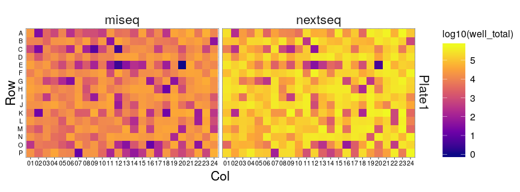
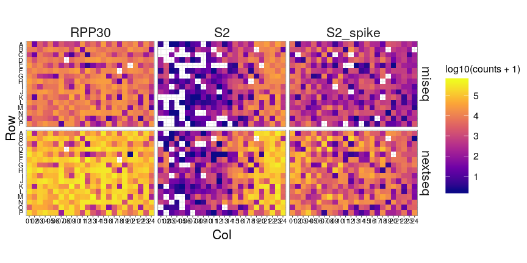
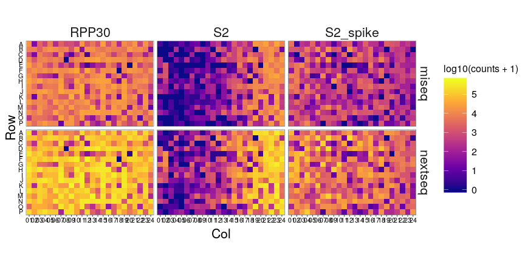
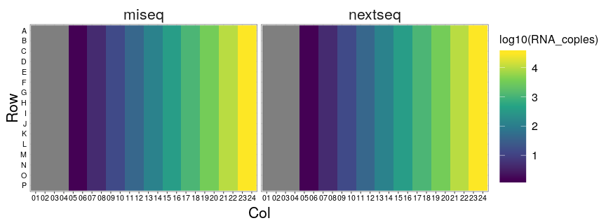
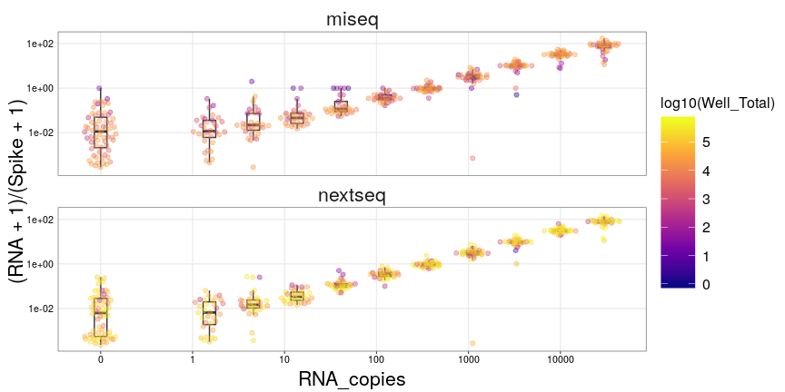
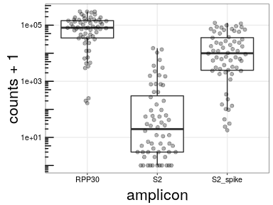
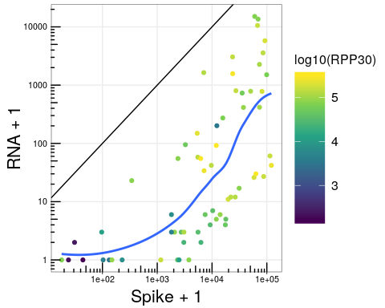
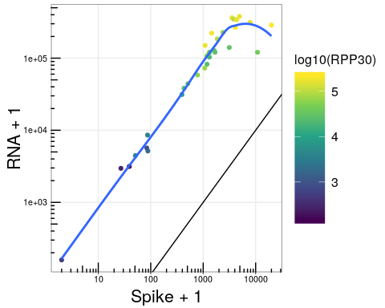

Run07 - Limit of Detection
================
Nate
04/29/2020

  - [Setup](#setup)
      - [Reads per Well](#reads-per-well)
      - [Explicit Zeros](#explicit-zeros)
      - [Getting Oriented](#getting-oriented)
  - [Basic Plot](#basic-plot)
  - [No Template Control Issues](#no-template-control-issues)
      - [S2\_Spike Correlation](#s2_spike-correlation)

# Setup

Import and load everything

``` r
# plotting
library(ggbeeswarm) # <- geom_quasirandom

# tidyverse
library(magrittr)
library(tidyverse)

# ------------------------------------------------------------------------------------
# style plots

theme_pub <- function(base_size = 11, base_family = "") {
  # based on https://github.com/noamross/noamtools/blob/master/R/theme_nr.R
  # start with theme_bw and modify from there!
  theme_bw(base_size = base_size, base_family = base_family) +# %+replace%
    theme(
      # grid lines
      panel.grid.major.x = element_line(colour="#ECECEC", size=0.5, linetype=1),
      panel.grid.minor.x = element_blank(),
      panel.grid.minor.y = element_blank(),
      panel.grid.major.y = element_line(colour="#ECECEC", size=0.5, linetype=1),
      panel.background   = element_blank(),
      
      # axis options
      axis.ticks.y   = element_blank(),
      axis.title.x   = element_text(size=rel(2), vjust=0.25),
      axis.title.y   = element_text(size=rel(2), vjust=0.35),
      axis.text      = element_text(color="black", size=rel(1)),
      
      # legend options
      legend.title    = element_text(size=rel(1.5)),
      legend.key      = element_rect(fill="white"),
      legend.key.size = unit(1, "cm"),
      legend.text     = element_text(size=rel(1.5)),
      
      # facet options
      strip.text = element_text(size=rel(2)),
      strip.background = element_blank(),
      
      # title options
      plot.title = element_text(size=rel(2.25), vjust=0.25, hjust=0.5)
    )
}
theme_set(theme_pub(base_size=8))

# ------------------------------------------------------------------------------------
# load data

nextseq <- '200429_NB552046_0040_AHVGFNBGXF'
miseq <- '200429_M05737_0146_000000000-J46DN'

# raw kallisto counts
kallisto.counts <- bind_rows(
  nextseq = read_tsv(str_c('../../pipeline/', nextseq, '/kallisto.counts.tsv'), col_names = c('i7i5', 'foo', 'ref', 'counts')),
  miseq = read_tsv(str_c('../../pipeline/', miseq, '/kallisto.counts.tsv'), col_names = c('i7i5', 'foo', 'ref', 'counts')),
  .id = 'sequencer'
) %>%
  mutate(
    index =  str_sub(i7i5, end=10),
    index2 = str_sub(i7i5, start=11)
  )

# reads aligning to our library
counts <- bind_rows(
  nextseq = read_tsv(str_c('../../pipeline/', nextseq, '/kb.tsv'), col_names = c('i7i5', 'foo', 'ref', 'counts')),
  miseq = read_tsv(str_c('../../pipeline/', miseq, '/kb.tsv'), col_names = c('i7i5', 'foo', 'ref', 'counts')),
  .id = 'sequencer'
) %>%
  mutate(
    index =  str_sub(i7i5, end=10),
    index2 = str_sub(i7i5, start=11)
  ) %>%
  select(-foo)

bc.map <- bind_rows(
  nextseq = read_tsv(str_c('../../pipeline/', nextseq, '/transcripts.txt'), col_names = 'amplicon'),
  miseq =   read_tsv(str_c('../../pipeline/', miseq,   '/transcripts.txt'), col_names = 'amplicon'),
  .id = 'sequencer'
) %>%
  group_by(sequencer) %>%
  mutate(ref = 1:n() - 1) %>%
  ungroup() %>%
  filter(str_detect(amplicon, 'N1', negate=TRUE)) %>%
  mutate(target = if_else(str_detect(amplicon, 'S2'), 'S2', 'RPP30'))

cond <- bind_rows(
  nextseq = read_csv(str_c('../../pipeline/', nextseq, '/conditions.csv')),
  miseq =   read_csv(str_c('../../pipeline/', miseq,   '/conditions.csv')),
  .id = 'sequencer'
) %>%
  mutate(target = if_else(str_sub(Sample_ID, -1, -1) == '1', 'S2', 'RPP30'))
```

## Reads per Well

``` r
counts %>%
  inner_join(bc.map) %>%
  inner_join(cond) %>%
  count(sequencer, Plate_ID, Sample_Well, wt=counts, name='well_total') %>%
  mutate(
    Row = factor(str_sub(Sample_Well, 1, 1), levels = rev(LETTERS[1:16])),
    Col = str_sub(Sample_Well, 2)
  ) %>%
  ggplot(aes(x=Col, y=Row, fill=log10(well_total))) +
  geom_tile() +
  coord_equal() +
  facet_grid(Plate_ID ~ sequencer) +
  scale_fill_viridis_c(option='plasma')
```

<!-- -->

### Split out By Amplicon

``` r
counts %>%
  inner_join(bc.map) %>%
  inner_join(cond) %>%
  mutate(
    Row = factor(str_sub(Sample_Well, 1, 1), levels = rev(LETTERS[1:16])),
    Col = str_sub(Sample_Well, 2)
  ) %>%
  ggplot(aes(x=Col, y=Row, fill=log10(counts + 1))) +
  geom_tile() +
  coord_equal() +
  facet_grid(sequencer ~ amplicon) +
  scale_fill_viridis_c(option='plasma')
```

<!-- -->

## Explicit Zeros

Since we know what barcodes to expect in each well, we can add explicit
zeros to barcodes that drop out.

``` r
df <- left_join(cond, bc.map)  %>%
  left_join(counts) %>%
  select(-i7i5) %>%
  replace_na(list(counts = 0)) %>%
  mutate(
    Row = factor(str_sub(Sample_Well, 1, 1), levels = rev(LETTERS)),
    Col = str_sub(Sample_Well, 2)
  ) 

df %>%
 ggplot(aes(x=Col, y=Row, fill=log10(counts + 1))) +
  geom_tile() +
  coord_equal() +
  facet_grid(sequencer ~ amplicon) +
  scale_fill_viridis_c(option='plasma')
```

<!-- -->

## Getting Oriented

This experiment is very simple - one plate, RNA titration, and NextSeq
vs Miseq

``` r
df %>%
  ggplot(aes(x=Col, y=Row, fill=log10(RNA_copies))) +
  geom_raster() +
  facet_wrap(~sequencer) +
  scale_fill_viridis_c()
```

<!-- -->

### Grab Nulls and Well Totals

We need to get our amplicon, spike, and Rpp30 reads into separate
columns. From that, we can grab our nulls.

``` r
well.total <- df %>%
  count(sequencer, Row, Col, wt=counts, name='Well_Total')

# because our data is pretty simple we can just modify the nulls in place
df.wide <- df %>%
  filter(amplicon == 'RPP30' | str_detect(amplicon, 'S2')) %>%
  mutate(amplicon = case_when(amplicon == 'RPP30' ~ 'RPP30',
                              str_detect(amplicon, 'spike') ~ 'Spike',
                              TRUE ~ 'RNA')
  ) %>%
  select(sequencer, Row, Col, RNA_copies, amplicon, counts) %>%
  spread(amplicon, counts)

nulls <- df.wide %>%
  filter(RNA_copies == 0) %>%
  mutate(RNA_copies = 0.1) %>%
  nest(nulls = c(-sequencer))
```

# Basic Plot

``` r
df.wide %>%
    inner_join(well.total) %>%
    mutate(RNA_copies = if_else(RNA_copies == 0, 0.1, RNA_copies)) %>%
    ggplot(aes(x=RNA_copies, y=(RNA+1)/(Spike+1), group=RNA_copies)) +
    geom_boxplot(outlier.shape = NA) +
    geom_quasirandom(alpha=0.4, aes(color=log10(Well_Total))) +
    scale_x_log10(breaks = c(10^(-1:4)), labels = c(0,10^(0:4))) +
    scale_y_log10() +
    facet_wrap(~sequencer, ncol=1) +
    scale_color_viridis_c(option = 'plasma')
```

<!-- -->

# No Template Control Issues

Let’s plot the raw counts in the no template control wells (looking at
nextseq only)

``` r
df %>%
    filter(RNA_copies == 0, sequencer == 'nextseq') %>%
    ggplot(aes(x=amplicon, y=counts + 1)) +
    geom_boxplot(outlier.shape = NA) +
    geom_quasirandom(alpha=0.3, width=0.3) +
    scale_y_log10() +
    annotation_logticks(sides = 'l')
```

<!-- -->

Our expectation is that no S2 amplicon should have any reads. We can see
that we are not too far off - the median read counts \~10. However,
there is a long tail of wells with \>1000 reads\!

## S2\_Spike Correlation

### No Template Wells

Maybe

``` r
df.wide %>%
  filter(RNA_copies == 0, sequencer == 'nextseq') %>%
  ggplot(aes(y=RNA + 1, x=Spike + 1, color=log10(RPP30))) +
  geom_point() +
  geom_abline() +
  geom_smooth(se=F) +
  scale_x_log10() +
  scale_y_log10() +
  annotation_logticks() +
  scale_color_viridis_c()
```

<!-- -->

### Max Template Wells

``` r
df.wide %>%
  filter(RNA_copies == 30000, sequencer == 'nextseq') %>%
  ggplot(aes(y=RNA + 1, x=Spike + 1, color=log10(RPP30))) +
  geom_point() +
  geom_abline() +
  geom_smooth(se=F) +
  scale_x_log10() +
  scale_y_log10() +
  annotation_logticks() +
  scale_color_viridis_c()
```

<!-- -->

### Finding Good/Bad Wells

Let’s find the top5 most represented wells in the no temoplate control
condition

``` r
df.wide %>%
  filter(RNA_copies == 0) %>%
  group_by(sequencer) %>%
  top_n(5, wt=RNA) %>%
  arrange(sequencer, RNA)
```

    ## # A tibble: 10 x 7
    ## # Groups:   sequencer [2]
    ##    sequencer Row   Col   RNA_copies   RNA  RPP30 Spike
    ##    <chr>     <fct> <chr>      <dbl> <dbl>  <dbl> <dbl>
    ##  1 miseq     H     02             0   357  14426  8596
    ##  2 miseq     G     01             0   696  16723  9569
    ##  3 miseq     F     02             0  1081  16502  6308
    ##  4 miseq     G     02             0  1359   5862  6470
    ##  5 miseq     E     02             0  1533   5746  5969
    ##  6 nextseq   H     02             0  3573 139062 85315
    ##  7 nextseq   G     01             0  5780 189360 92344
    ##  8 nextseq   F     02             0 10564 154535 67638
    ##  9 nextseq   G     02             0 13584  72968 69233
    ## 10 nextseq   E     02             0 15096  74755 60088

Encouragingly they are the same across sequencers.
