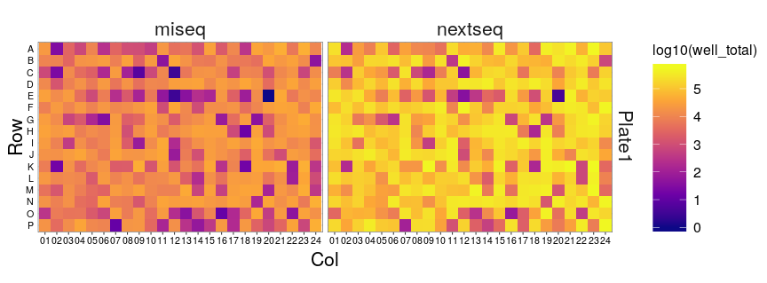
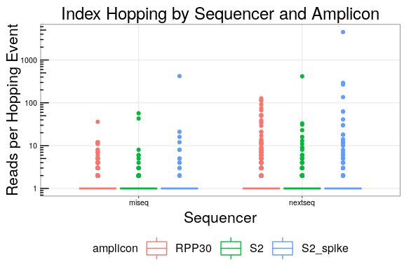
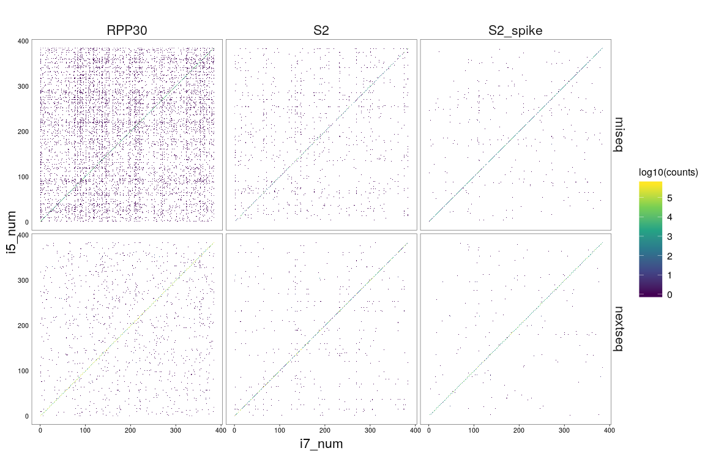

Run07 - Index Hopping
================
Nate
04/29/2020

  - [Read Per Well Check](#read-per-well-check)
  - [Barcode (index) Hopping](#barcode-index-hopping)
      - [Prep](#prep)
      - [Perfect Matches](#perfect-matches)
      - [Perfect Matches with Different Primer
        Sets](#perfect-matches-with-different-primer-sets)
      - [Problematic Indices](#problematic-indices)

## Read Per Well Check

First, let’s make sure the expected counts per well look correct

``` r
counts %>%
  inner_join(bc.map) %>%
  inner_join(cond) %>%
  count(sequencer, Plate_ID, Sample_Well, wt=counts, name='well_total') %>%
  mutate(
    Row = factor(str_sub(Sample_Well, 1, 1), levels = rev(LETTERS[1:16])),
    Col = str_sub(Sample_Well, 2)
  ) %>%
  ggplot(aes(x=Col, y=Row, fill=log10(well_total))) +
  geom_tile() +
  coord_equal() +
  facet_grid(Plate_ID ~ sequencer) +
  scale_fill_viridis_c(option='plasma')
```

<!-- -->

Great.

# Barcode (index) Hopping

## Prep

Let’s try to quantify some barcode hopping. First let’s load in the
primer orders so we can get pair information. Remember, we have to
reverse compliment the indices depending on the sequencer and the set.

``` r
primer.sets <- read_tsv('../../data/primer-order.tsv')

revcomp <- function(string){
  chartr('ATGC', 'TACG', string) %>% 
    stringi::stri_reverse() %>%
    return()
}

# recall the orientations
# S2    - i5:F, i7:R
# RPP30 - i7:F, i5:R
# we must rev-comp S2_R and RPP30_F
foo <- primer.sets %>%
  filter(set == 'RPP30') %>%
  mutate(
    index = revcomp(f_idx),
    index2 = r_idx
  ) 

bar <- primer.sets %>%
  filter(set == 'S2') %>%
  mutate(
    index = revcomp(r_idx),
    index2 = f_idx
  ) 

miseq.orient <- bind_rows(foo, bar)
nextseq.orient <- bind_rows(foo, bar) %>%
  mutate(index2 = revcomp(index2))

primer.orient <- bind_rows(
  nextseq = nextseq.orient,
  miseq = miseq.orient,
  .id = 'sequencer'
) %>%
  inner_join(cond) %>%
  arrange(index) %>%
  group_by(sequencer, set) %>%
  mutate(well_num = row_number()) %>%
  select(sequencer, set, pair_num, well_num, Sample_Well, index, index2) %>%
  ungroup()
```

Select out the individual i7/i5 indices and their associated primer pair
id. We can then join them in sequentially and look for any discrepancies
betweent the pair numbers.

``` r
i7 <- primer.orient %>%
  select(sequencer, index, i5=index2, i7_pair = pair_num, i7_well = Sample_Well, i7_num = well_num) 

i5 <- primer.orient %>%
  select(sequencer, index2, i7=index, i5_pair = pair_num, i5_well = Sample_Well, i5_num = well_num)

index.join <- kallisto.counts %>%
  left_join(i7) %>%
  left_join(i5) %>%
  inner_join(bc.map)
```

## Perfect Matches

First, let’s make sure this procedure is working. Let’s sum up the reads
for perfect matches. Note this should be pretty close to the final
Kallisto output (with theirs being higher since they correct for dist=1
errors)

``` r
index.join %>%
  filter(i7_num == i5_num) %>%
  count(sequencer, wt=counts)
```

    ## # A tibble: 2 x 2
    ##   sequencer        n
    ##   <chr>        <dbl>
    ## 1 miseq      4920207
    ## 2 nextseq   54890492

``` r
# now the kallisto corrected data
counts %>%
  count(sequencer, wt=counts)
```

    ## # A tibble: 2 x 2
    ##   sequencer        n
    ##   <chr>        <dbl>
    ## 1 miseq      5604311
    ## 2 nextseq   57673700

The deviation between the two is reasonable.

## Perfect Matches with Different Primer Sets

If we get an i7/i5 match, but they have a different primer “number” we
can be sure it came from an index hopping event\! Let’s plot the
distribution of reads for each one of these events.

``` r
index.join %>%
  filter(i7_num != i5_num) %>%
  ggplot(aes(x=sequencer, y=counts, color=amplicon)) +
  geom_boxplot() +
  scale_y_log10() +
  annotation_logticks(sides = 'l') +
  labs(
    x = 'Sequencer',
    y = 'Reads per Hopping Event',
    title = 'Index Hopping by Sequencer and Amplicon'
  ) +
  theme(legend.position = 'bottom')
```

<!-- -->

This is great\! The median read per event is 1, suggesting that index
hopping is not a big deal.

## Problematic Indices

Let’s see if any index is particularly promiscuous. Our sample sheet
defines what set of indices should be in each well. By looking at
improper index pairs

``` r
index.join %>%
    filter(
        !is.na(i5),
        !is.na(i7)
    ) %>%
    ggplot(aes(x=i7_num, y=i5_num, fill=log10(counts))) +
    geom_raster() +
    coord_equal() +
    facet_grid(sequencer ~ amplicon) +
    scale_fill_viridis_c() +
    theme(panel.grid.major.x = element_blank(), panel.grid.major.y = element_blank())
```

<!-- -->
