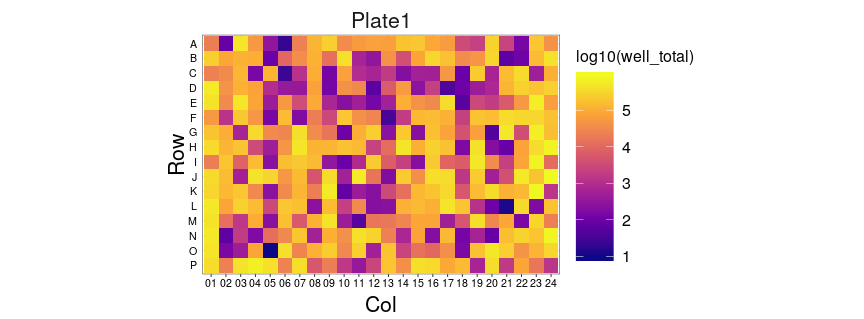
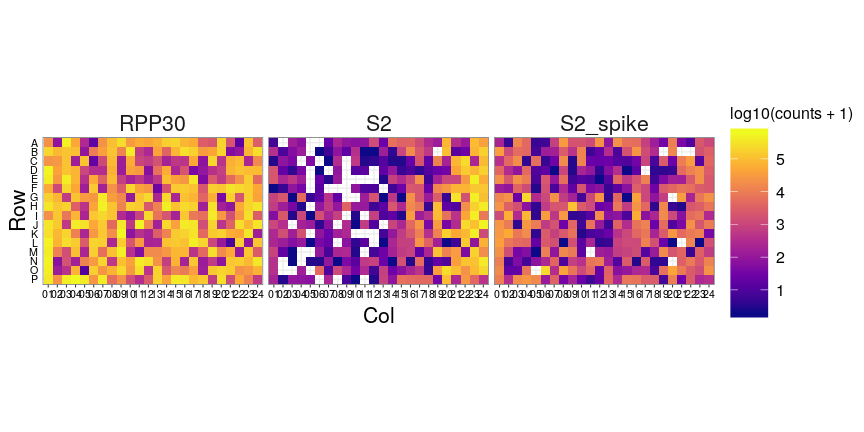
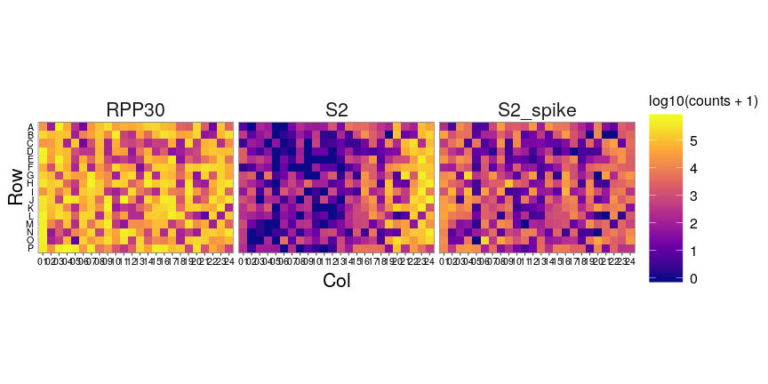
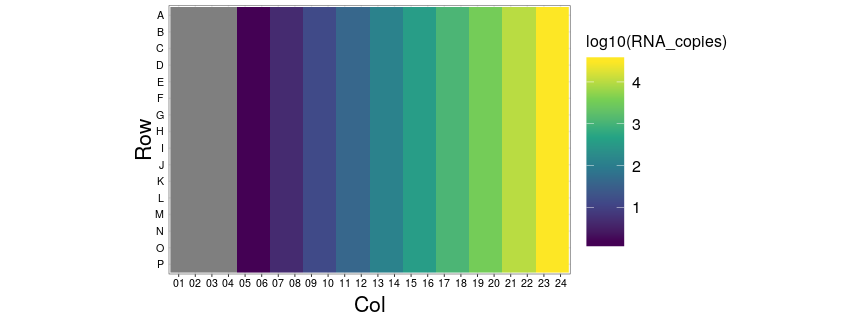
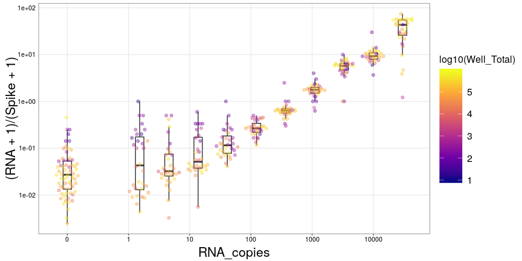
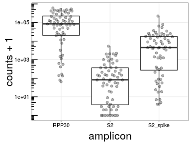
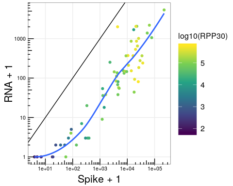
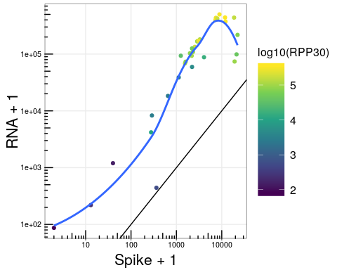
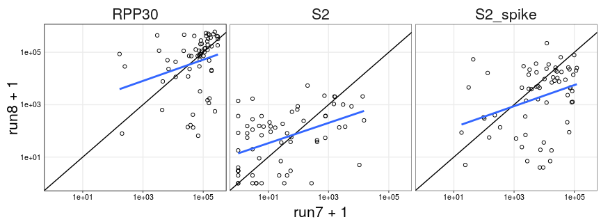

Run08 - Hand Pipetting
================
Nate
05/02/2020

  - [Read Per Well Check](#read-per-well-check)
  - [Explicit Zeros](#explicit-zeros)
  - [Getting Oriented](#getting-oriented)
  - [Basic Plot](#basic-plot)
  - [No Template Control Issues](#no-template-control-issues)
      - [S2\_Spike Correlation](#s2_spike-correlation)
  - [NTC Wells Between Runs](#ntc-wells-between-runs)
      - [Correlation Between Runs (In NTC
        Wells)](#correlation-between-runs-in-ntc-wells)

## Read Per Well Check

First, let’s make sure the expected counts per well look correct

``` r
counts %>%
  inner_join(bc.map) %>%
  inner_join(cond) %>%
  count(Plate_ID, Sample_Well, wt=counts, name='well_total') %>%
  mutate(
    Row = factor(str_sub(Sample_Well, 1, 1), levels = rev(LETTERS[1:16])),
    Col = str_sub(Sample_Well, 2)
  ) %>%
  ggplot(aes(x=Col, y=Row, fill=log10(well_total))) +
  geom_tile() +
  coord_equal() +
  facet_wrap(~Plate_ID) +
  scale_fill_viridis_c(option='plasma')
```

<!-- -->

### Split out By Amplicon

``` r
counts %>%
  inner_join(bc.map) %>%
  inner_join(cond) %>%
  mutate(
    Row = factor(str_sub(Sample_Well, 1, 1), levels = rev(LETTERS[1:16])),
    Col = str_sub(Sample_Well, 2)
  ) %>%
  ggplot(aes(x=Col, y=Row, fill=log10(counts + 1))) +
  geom_tile() +
  coord_equal() +
  facet_wrap( ~ amplicon) +
  scale_fill_viridis_c(option='plasma')
```

<!-- -->

## Explicit Zeros

Since we know what barcodes to expect in each well, we can add explicit
zeros to barcodes that drop out.

``` r
df <- left_join(cond, bc.map)  %>%
  left_join(counts) %>%
  select(-i7i5) %>%
  replace_na(list(counts = 0)) %>%
  mutate(
    Row = factor(str_sub(Sample_Well, 1, 1), levels = rev(LETTERS)),
    Col = str_sub(Sample_Well, 2)
  ) 

df %>%
 ggplot(aes(x=Col, y=Row, fill=log10(counts + 1))) +
  geom_tile() +
  coord_equal() +
  facet_wrap(~ amplicon) +
  scale_fill_viridis_c(option='plasma')
```

<!-- -->

## Getting Oriented

This experiment is very simple - one plate, RNA titration, and NextSeq
vs Miseq

``` r
df %>%
  ggplot(aes(x=Col, y=Row, fill=log10(RNA_copies))) +
  geom_raster() +
  coord_equal() +
  scale_fill_viridis_c()
```

<!-- -->

### Grab Nulls and Well Totals

We need to get our amplicon, spike, and Rpp30 reads into separate
columns. From that, we can grab our nulls.

``` r
well.total <- df %>%
  count(Row, Col, wt=counts, name='Well_Total')

# because our data is pretty simple we can just modify the nulls in place
df.wide <- df %>%
  filter(amplicon == 'RPP30' | str_detect(amplicon, 'S2')) %>%
  mutate(amplicon = case_when(amplicon == 'RPP30' ~ 'RPP30',
                              str_detect(amplicon, 'spike') ~ 'Spike',
                              TRUE ~ 'RNA')
  ) %>%
  select(Row, Col, RNA_copies, amplicon, counts) %>%
  spread(amplicon, counts)

# nulls <- df.wide %>%
#   filter(RNA_copies == 0) %>%
#   mutate(RNA_copies = 0.1) %>%
#   nest(nulls = c(-sequencer))
```

# Basic Plot

``` r
df.wide %>%
    inner_join(well.total) %>%
    mutate(RNA_copies = if_else(RNA_copies == 0, 0.1, RNA_copies)) %>%
    ggplot(aes(x=RNA_copies, y=(RNA+1)/(Spike+1), group=RNA_copies)) +
    geom_boxplot(outlier.shape = NA) +
    geom_quasirandom(alpha=0.4, aes(color=log10(Well_Total))) +
    scale_x_log10(breaks = c(10^(-1:4)), labels = c(0,10^(0:4))) +
    scale_y_log10() +
    #facet_wrap(~sequencer, ncol=1) +
    scale_color_viridis_c(option = 'plasma')
```

<!-- -->

# No Template Control Issues

Let’s plot the raw counts in the no template control wells (looking at
nextseq only)

``` r
df %>%
    filter(RNA_copies == 0) %>%
    ggplot(aes(x=amplicon, y=counts + 1)) +
    geom_boxplot(outlier.shape = NA) +
    geom_quasirandom(alpha=0.3, width=0.3) +
    scale_y_log10() +
    annotation_logticks(sides = 'l')
```

<!-- -->

Our expectation is that no S2 amplicon should have any reads. We can see
that we are not too far off - the median read counts \~10. However,
there is a long tail of wells with \>1000 reads\!

## S2\_Spike Correlation

### No Template Wells

Maybe

``` r
df.wide %>%
  filter(RNA_copies == 0) %>%
  ggplot(aes(y=RNA + 1, x=Spike + 1, color=log10(RPP30))) +
  geom_point() +
  geom_abline() +
  geom_smooth(se=F) +
  scale_x_log10() +
  scale_y_log10() +
  annotation_logticks() +
  scale_color_viridis_c()
```

<!-- -->

### Max Template Wells

``` r
df.wide %>%
  filter(RNA_copies == 30000) %>%
  ggplot(aes(y=RNA + 1, x=Spike + 1, color=log10(RPP30))) +
  geom_point() +
  geom_abline() +
  geom_smooth(se=F) +
  scale_x_log10() +
  scale_y_log10() +
  annotation_logticks() +
  scale_color_viridis_c()
```

<!-- -->

### Finding Good/Bad Wells

Let’s find the top5 most represented wells in the no temoplate control
condition

``` r
df.wide %>%
  filter(RNA_copies == 0) %>%
  top_n(5, wt=RNA) %>%
  arrange(-RNA)
```

    ## # A tibble: 5 x 6
    ##   Row   Col   RNA_copies   RNA  RPP30  Spike
    ##   <fct> <chr>      <dbl> <dbl>  <dbl>  <dbl>
    ## 1 G     04             0  5365 114870 222896
    ## 2 I     02             0  2197 127491  64356
    ## 3 G     02             0  2061  79109  22341
    ## 4 E     01             0  2051 417284  20709
    ## 5 D     01             0  2003 536262   4400

# NTC Wells Between Runs

Is there any correlation? First we have to load in Run7 data

``` r
run7.nextseq <- '200429_NB552046_0040_AHVGFNBGXF'

counts.run7 <-read_tsv(str_c('../../pipeline/', run7.nextseq, '/kb.tsv'), col_names = c('i7i5', 'foo', 'ref', 'counts')) %>%
  mutate(
    index =  str_sub(i7i5, end=10),
    index2 = str_sub(i7i5, start=11)
  )

df.7 <- left_join(cond, bc.map)  %>%
  left_join(counts.run7) %>%
  select(-i7i5) %>%
  replace_na(list(counts = 0)) %>%
  mutate(
    Row = factor(str_sub(Sample_Well, 1, 1), levels = rev(LETTERS)),
    Col = str_sub(Sample_Well, 2)
  )

df.wide.7 <- df.7 %>%
  filter(amplicon == 'RPP30' | str_detect(amplicon, 'S2')) %>%
  mutate(amplicon = case_when(amplicon == 'RPP30' ~ 'RPP30',
                              str_detect(amplicon, 'spike') ~ 'Spike',
                              TRUE ~ 'RNA')
  ) %>%
  select(Row, Col, RNA_copies, amplicon, counts) %>%
  spread(amplicon, counts)
```

## Correlation Between Runs (In NTC Wells)

``` r
bind_rows(run7 = df.7, run8 = df, .id = 'Run') %>%
    filter(RNA_copies == 0) %>%
    select(Run, amplicon, counts, Row, Col) %>%
    spread(Run, counts) %>%
    ggplot(aes(x=run7 + 1, y=run8 + 1)) +
    geom_point(pch=21) +
    geom_abline() +
    geom_smooth(se=F, method='lm') +
    facet_wrap(~amplicon) +
    scale_x_log10() +
    scale_y_log10() 
```

<!-- -->

``` r
# actual values
bind_rows(run7 = df.7, run8 = df, .id = 'Run') %>%
    filter(RNA_copies == 0) %>%
    select(Run, amplicon, counts, Row, Col) %>%
    spread(Run, counts) %>%
    group_by(amplicon) %>%
    summarise(cor = cor(log10(run7 + 1), log10(run8 + 1)))
```

    ## # A tibble: 3 x 2
    ##   amplicon   cor
    ##   <chr>    <dbl>
    ## 1 RPP30    0.272
    ## 2 S2       0.445
    ## 3 S2_spike 0.323
