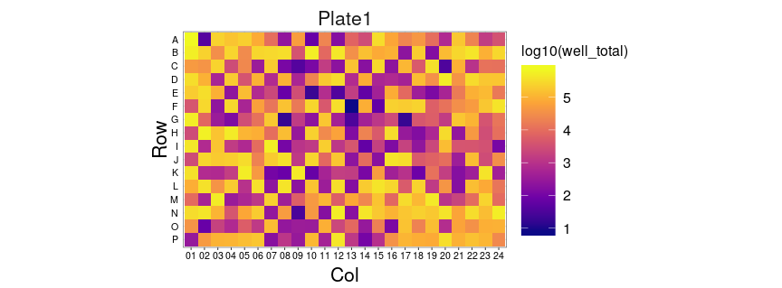
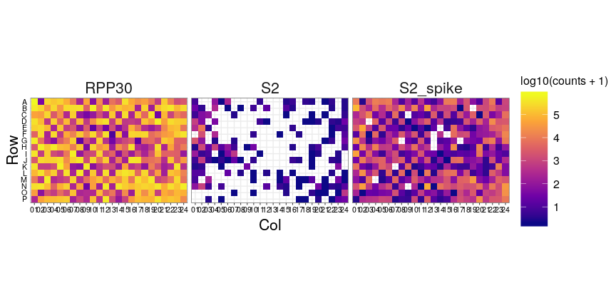
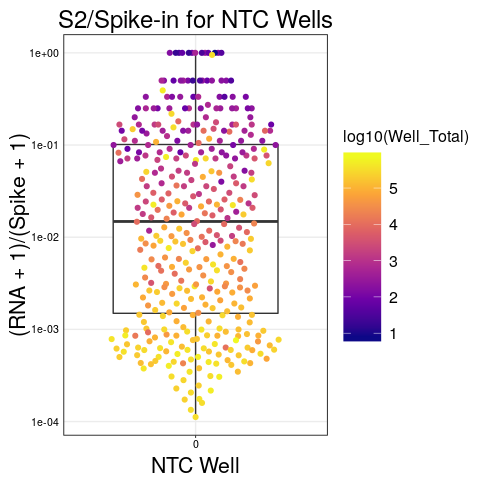
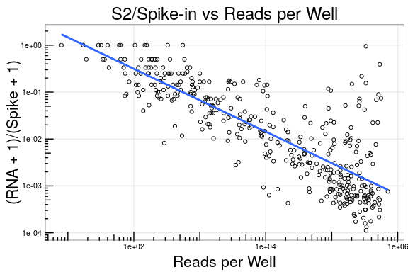

Run09 - No Template Control Plate
================
Nate
05/04/2020

  - [Read Per Well Check](#read-per-well-check)
  - [Explicit Zeros](#explicit-zeros)
  - [LoD](#lod)

## Read Per Well Check

First, let’s make sure the expected counts per well look correct

``` r
counts %>%
  inner_join(bc.map) %>%
  inner_join(cond) %>%
  count(Plate_ID, Sample_Well, wt=counts, name='well_total') %>%
  mutate(
    Row = factor(str_sub(Sample_Well, 1, 1), levels = rev(LETTERS[1:16])),
    Col = str_sub(Sample_Well, 2)
  ) %>%
  ggplot(aes(x=Col, y=Row, fill=log10(well_total))) +
  geom_tile() +
  coord_equal() +
  facet_wrap(~Plate_ID) +
  scale_fill_viridis_c(option='plasma')
```

<!-- -->

### Split out By Amplicon

``` r
counts %>%
  inner_join(bc.map) %>%
  inner_join(cond) %>%
  mutate(
    Row = factor(str_sub(Sample_Well, 1, 1), levels = rev(LETTERS[1:16])),
    Col = str_sub(Sample_Well, 2)
  ) %>%
  ggplot(aes(x=Col, y=Row, fill=log10(counts + 1))) +
  geom_tile() +
  coord_equal() +
  facet_wrap( ~ amplicon) +
  scale_fill_viridis_c(option='plasma')
```

<!-- -->

## Explicit Zeros

Since we know what barcodes to expect in each well, we can add explicit
zeros to barcodes that drop out.

``` r
df <- left_join(cond, bc.map)  %>%
  left_join(counts) %>%
  select(-i7i5) %>%
  replace_na(list(counts = 0)) %>%
  mutate(
    Row = factor(str_sub(Sample_Well, 1, 1), levels = rev(LETTERS)),
    Col = str_sub(Sample_Well, 2)
  ) 

df %>%
  ggplot(aes(x=Col, y=Row, fill=log10(counts + 1))) +
  geom_tile() +
  coord_equal() +
  facet_wrap(~ amplicon) +
  scale_fill_viridis_c(option='plasma')
```

<!-- -->

### Grab Nulls and Well Totals

We need to get our amplicon, spike, and Rpp30 reads into separate
columns. From that, we can grab our nulls.

``` r
well.total <- df %>%
  count(Row, Col, wt=counts, name='Well_Total')

# because our data is pretty simple we can just modify the nulls in place
df.wide <- df %>%
  filter(amplicon == 'RPP30' | str_detect(amplicon, 'S2')) %>%
  mutate(amplicon = case_when(amplicon == 'RPP30' ~ 'RPP30',
                              str_detect(amplicon, 'spike') ~ 'Spike',
                              TRUE ~ 'RNA')
  ) %>%
  select(Row, Col, RNA_copies, amplicon, counts) %>%
  spread(amplicon, counts)
```

# LoD

``` r
df.wide %>%
  inner_join(well.total) %>%
  ggplot(aes(x=factor(RNA_copies), y=(RNA+1)/(Spike+1))) +
  geom_boxplot(outlier.shape = NA) +
  geom_quasirandom(aes(color=log10(Well_Total))) +
  scale_y_log10() +
  scale_color_viridis_c(option = 'plasma') +
  labs(
    x = 'NTC Well',
    title = 'S2/Spike-in for NTC Wells'
  )
```

<!-- -->

``` r
df.wide %>%
  inner_join(well.total) %>%
  mutate(RNA_copies = if_else(RNA_copies == 0, 0.1, RNA_copies)) %>%
  ggplot(aes(y=(RNA+1)/(Spike+1), x=Well_Total)) +
  geom_point(pch=21) +
  geom_smooth(se=F, method='lm') +
  scale_y_log10()  +
  scale_x_log10() +
  annotation_logticks() +
  labs(
    x = 'Reads per Well',
    title = 'S2/Spike-in vs Reads per Well'
  )
```

<!-- -->
