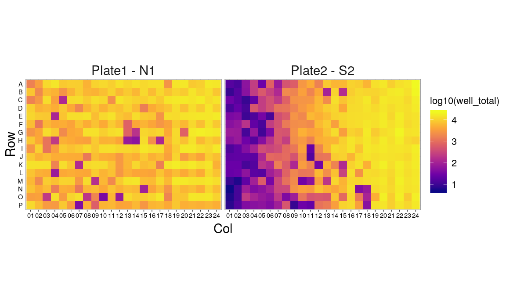
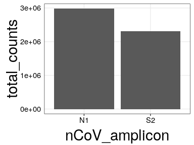
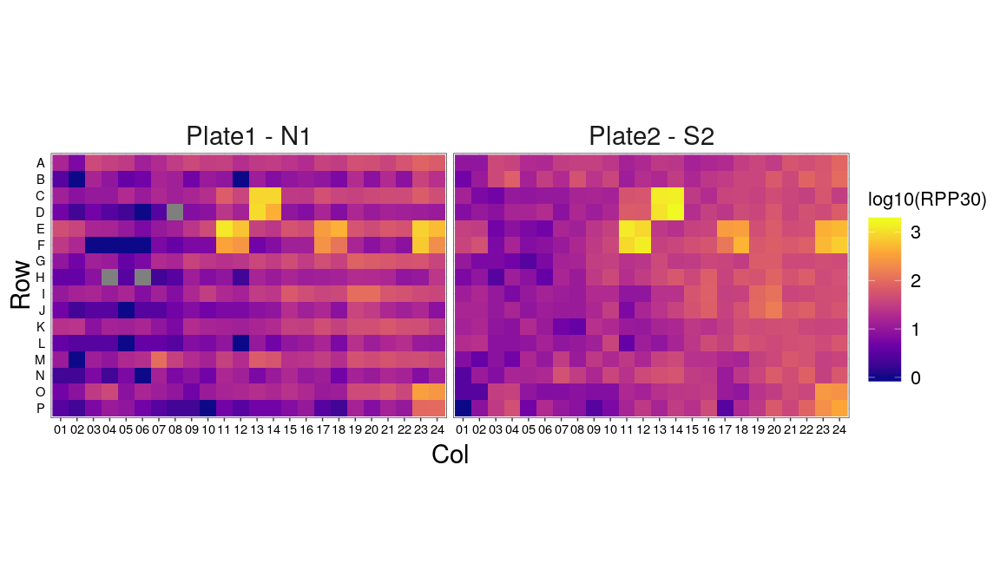
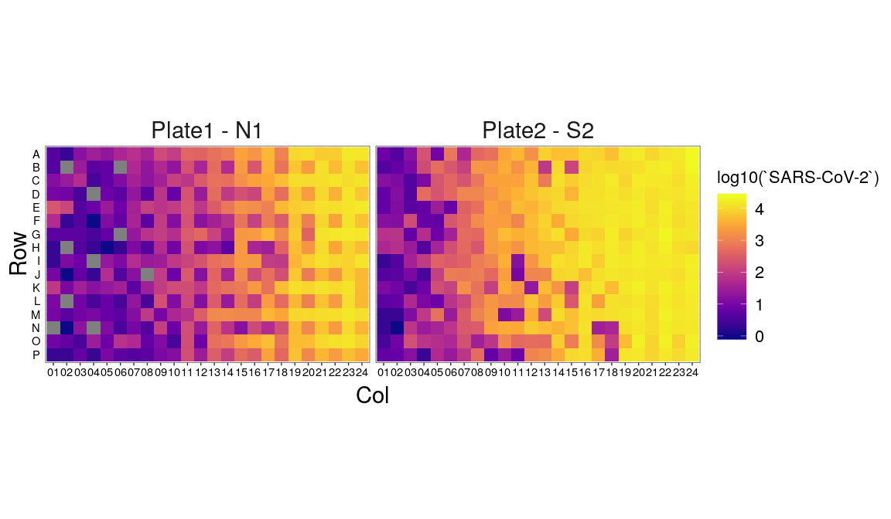
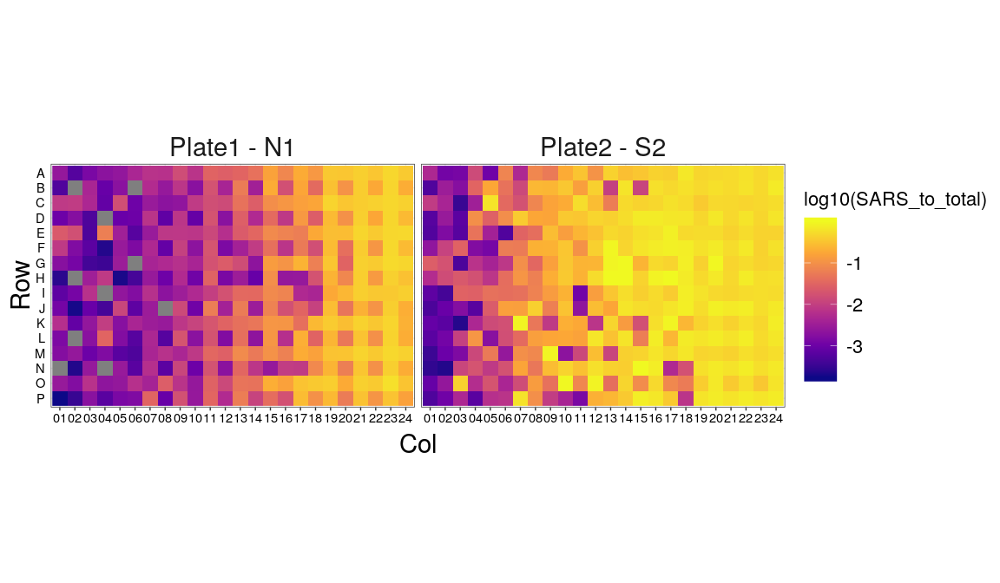
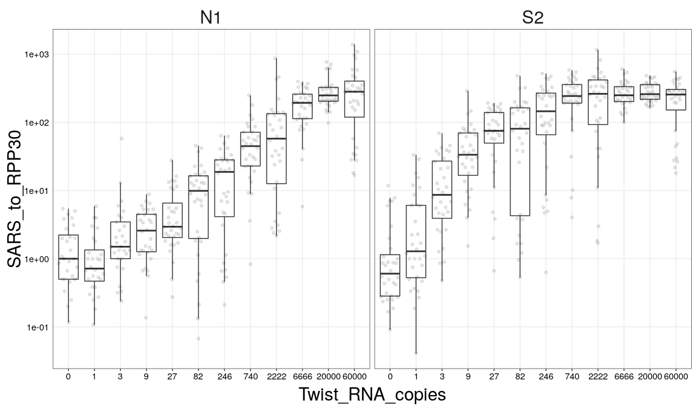
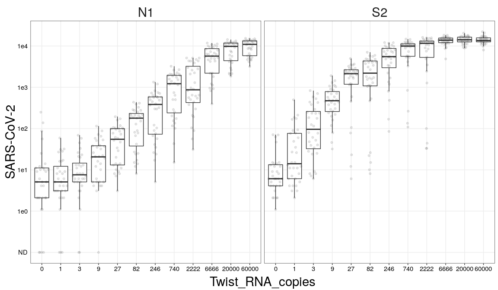
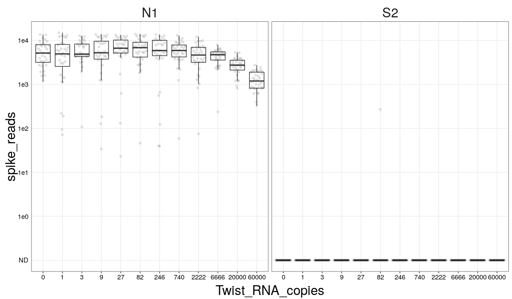
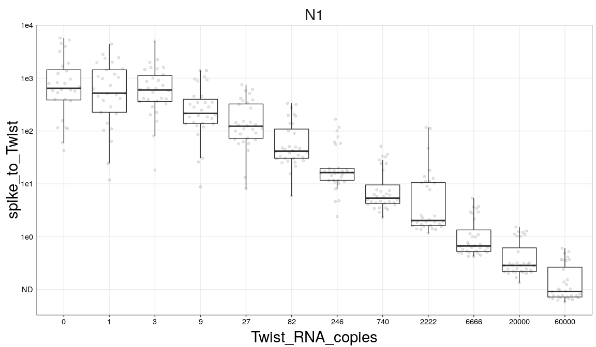
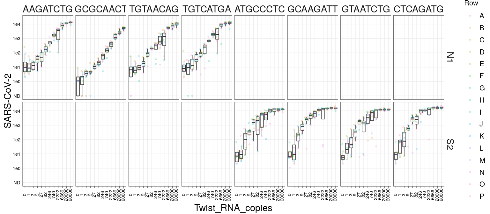

SARS-CoV-2 platform run 3 analysis
================
Aaron
04/02/2020

Let’s first just look at reads per well across our plates:

<!-- -->

N1 has more even coverage this time, but S2 looks bad\! Could be that
the RPP30 primer conc change was problematic– this was the run where we
tried 100 nM inner primer without adapter and 50 nM outer primer with
adapter for RPP30.

Regarding the N1 to S2 difference in depth, let’s sum across the plates:

<!-- -->

We are closer to 1:1 this time than in run01.

Let’s look at RPP30 reads between the plates/wells:

<!-- -->

These seem more even this time, which is nice. Perhaps it’s the 40
cycles of PCR instead of 45. There is still evidence of winning i7
primers, showing up in blocks of 4 (these were added with the
liquidator). The winners are different this time, though?

Let’s move on to look at nCoV reads:

<!-- -->

We did highest conc at right of plate for this expt, so this makes
sense.

Let’s plot this as a proportion of total reads:

<!-- -->

Let’s plot this out across the range of RNA copies we added in:

<!-- -->

The data are less noisy than run01. Are we getting signal from S2
amplicon at 3 copies?? This is unreal.

Let’s look at raw reads to see clearly where we’re getting none:

<!-- -->

We get some number of reads for nCoV in every well.

We still have the technical spike oligo issue, so let’s plot the spike
reads across conditions to try to get a sense of where they are showing
up:

<!-- -->

Clearly it’s not showing up in S2, which makes sense since the spike
doesn’t have priming sites for those primers. Let’s drill down on N1 and
look at proportions:

<!-- -->

Ratio is 1 between 2e3 and 6e3, agreeing with run01. Still our best
estimate for the level of contamination.

Now, let’s look at SARS reads across Twist RNA amounts, across our i5s:

<!-- -->

Some i5s look better than others. Need to think more about this.
