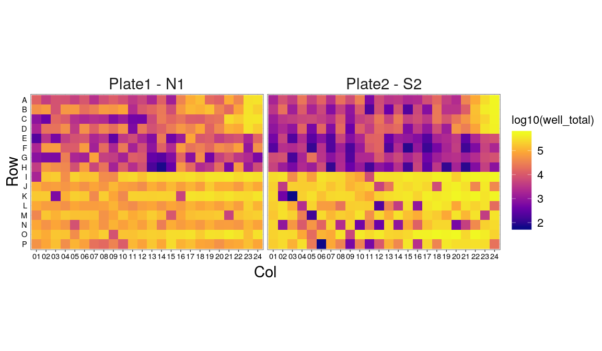
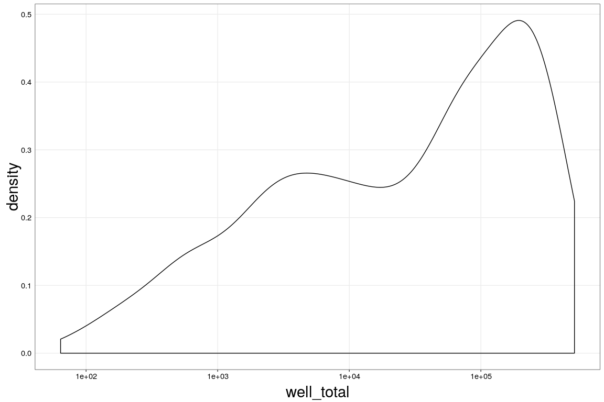
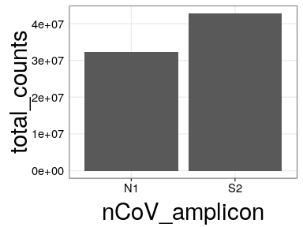
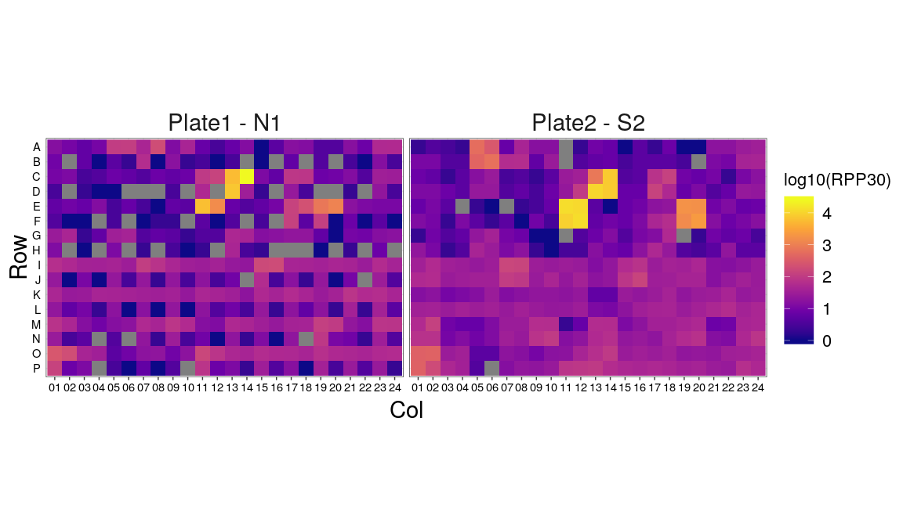
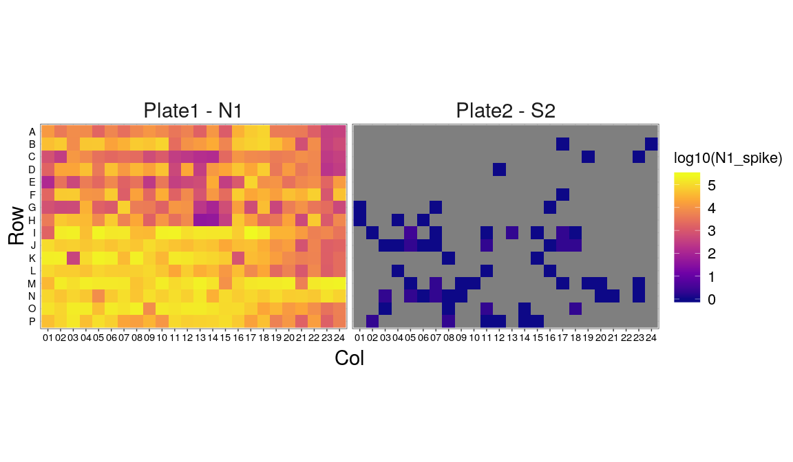
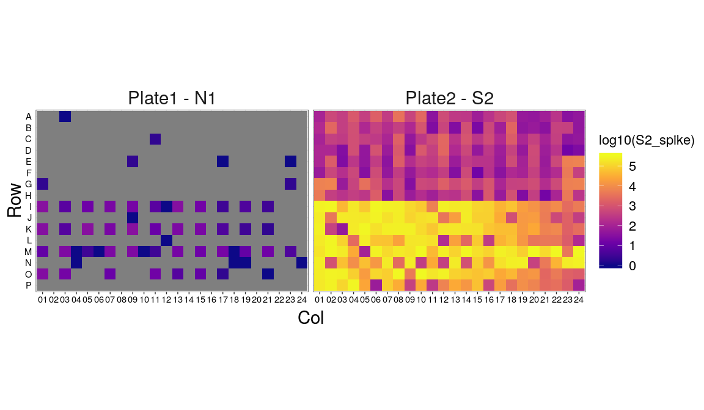
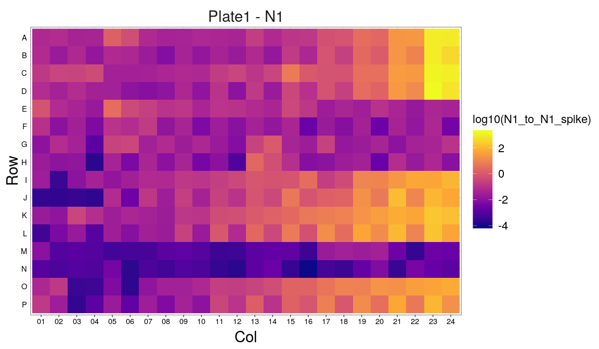
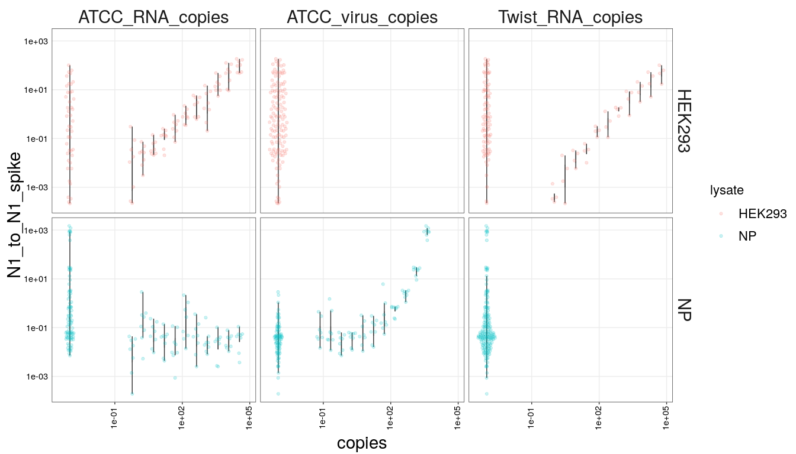
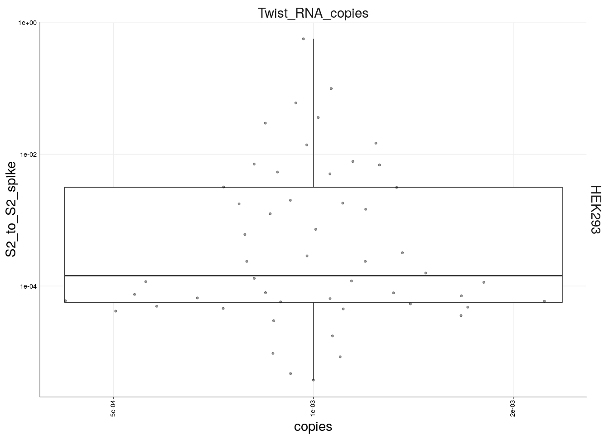

SARS-CoV-2 platform run 4 analysis
================
Aaron
04/03/2020

Let’s first just look at reads per well across our plates:

<!-- -->

N1 has more even coverage this time. Pretty, pretty, pretty even. S2
looks more variable, but about the same as run3. No row I dropouts this
time\! What the hell happened in run01?

Let’s look at distribution of well totals to possibly set a cutoff:

<!-- -->

If we had to do a cutoff, 1e4 might be slightly better than a shot in
the dark.

Regarding the N1 to S2 difference in depth, let’s sum across the plates:

<!-- -->

We are close to 1:1 this time, unlike run01.

Let’s look at RPP30 reads between the plates/wells:

<!-- -->

Very low coverage on RPP30 in this run for some reason.

Let’s move on to look at spike reads now that we have spikes for both
samples:

<!-- -->

<!-- -->

There is some amount of assay crossover, which can only be due to index
switching on the sequencer. Master mixes for these two plates were
prepped separately, and spike was only put into the matched plate
(i.e. N1 spike on N1 plate, S2 on S2 plate). Libraries were pooled per
plate, purified, and only then mixed. Could be something during bridge
amplification or something optical.

Let’s norm COVID to spike and plot it out across the range of RNA copies
we added in:

<!-- -->

Looks cool\! Let’s plot this across the nCoV range.

<!-- -->

Looks promising, but not in NP?

<!-- -->
